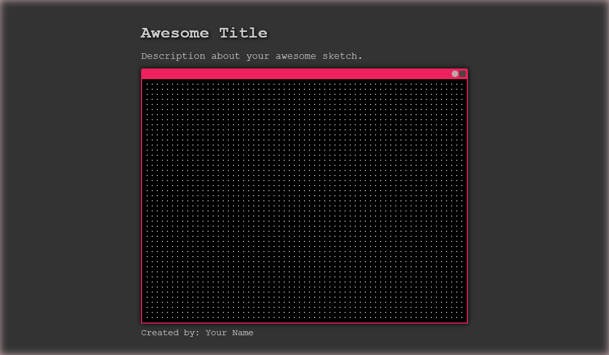
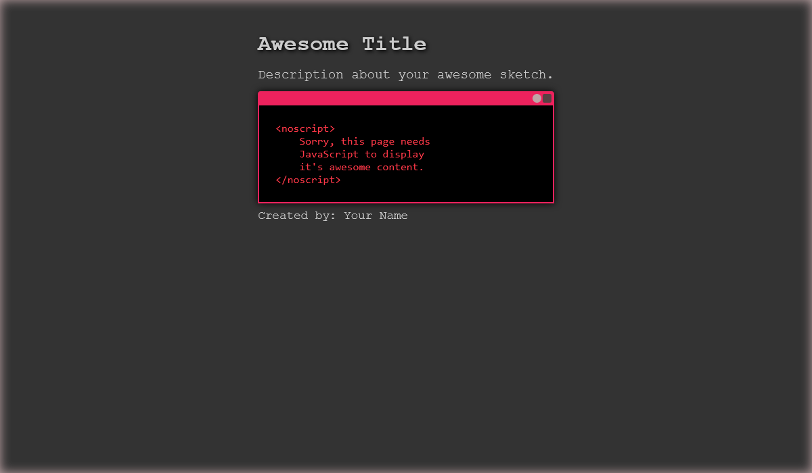

# p5\*js Template

I decided to make a template to display my [p5.js](https://p5js.org/) sketches, now that it doesn't look horrible, I'm sharing it with everyone.

## How to use

1.  Clone this repository
1.  Change the `title`, `description`, `creator` information in the `index.html` file.
1.  If you are sharing your sketch on [GitHub](https://github.com/), use this `README.md` file as to describe your sketch and how to use it and the `imgs/` folder for images you want to use in your `README.md` or sketch.

### Using local libraries

If you want to use local libraries. You can download the main library [here](https://p5js.org/download/) and addons [here](https://p5js.org/libraries/).
Don't forget to change the `script` sources in the `index.html` file.

```html
<!-- main library -->
<!-- <script src="p5/p5.min.js"></script> -->
<script
    src="https://cdnjs.cloudflare.com/ajax/libs/p5.js/1.4.1/p5.min.js"
    integrity="sha512-NxocnqsXP3zm0Xb42zqVMvjQIktKEpTIbCXXyhBPxqGZHqhcOXHs4pXI/GoZ8lE+2NJONRifuBpi9DxC58L0Lw=="
    crossorigin="anonymous"
    referrerpolicy="no-referrer"
></script>
```

## Online editor

It does work in the [p5.js online editor](https://editor.p5js.org/) though you need to do some things:

-   Replace the default files `index.html`, `style.css`, `sketch.js` with the ones from this repository.
-   Remove the favicon link (it won't work within the editor `code` or `preview`).
-   Don't forget to change the `title`, `description`, `creator` information in the `index.html` file.

Just keep in mind that the template is not meant to be used within the editor, but it does work and makes [preview pages](https://editor.p5js.org/antonio-m-o-costa/full/sAQvk5q-H) rather nice.

## [The unlicensed](LICENSE.md)

You may use this template for any purpose, but keep in mind that [p5.js](https://p5js.org/) it self is licensed differently. Check the [p5.js copyright](https://p5js.org/copyright.html) page for more information.

## Example images

| Normal preview                         | No script preview                        |
| -------------------------------------- | ---------------------------------------- |
|  |  |

I used `noscript` so it displays something when the browser doesn't support JavaScript or it's disabled.
